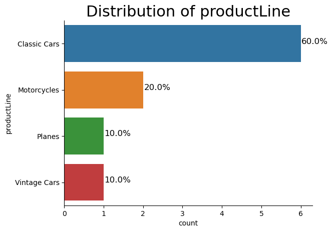

# Business Questions


## 1. Which products need more or less inventory?<a name = "Question_1"></a>

The goal is to optimize inventory levels by examining inventory reports to pinpoint in-demand products that are running low and analyze which products are selling well. This will help prevent popular items from going out of stock, improving the customer experience.

Top priority for restocking will be given to high-performing products that are nearing out of stock status. Promptly replenishing these successful, sought-after products will help maintain sufficient inventory to meet customer demand. Focusing restocking efforts on the most popular and fastest-selling items aligns with the objectives of keeping adequate stock of products customers want and providing a positive shopping experience.

**The top 10 low stock for each product**


```sql
%%sql
SELECT p.productCode,
       p.productName,
       sum(o.quantityOrdered)/p.quantityInStock as low_stock
  FROM products p 
  JOIN orderdetails o 
    ON p.productCode = o.productCode 
 GROUP BY p.productCode 
 ORDER BY low_stock DESC 
 LIMIT 10;
```

*Output:*


<table>
    <thead>
        <tr>
            <th>productCode</th>
            <th>productName</th>
            <th>low_stock</th>
        </tr>
    </thead>
    <tbody>
        <tr>
            <td>S24_2000</td>
            <td>1960 BSA Gold Star DBD34</td>
            <td>67</td>
        </tr>
        <tr>
            <td>S12_1099</td>
            <td>1968 Ford Mustang</td>
            <td>13</td>
        </tr>
        <tr>
            <td>S32_4289</td>
            <td>1928 Ford Phaeton Deluxe</td>
            <td>7</td>
        </tr>
        <tr>
            <td>S32_1374</td>
            <td>1997 BMW F650 ST</td>
            <td>5</td>
        </tr>
        <tr>
            <td>S72_3212</td>
            <td>Pont Yacht</td>
            <td>2</td>
        </tr>
        <tr>
            <td>S700_3167</td>
            <td>F/A 18 Hornet 1/72</td>
            <td>1</td>
        </tr>
        <tr>
            <td>S700_1938</td>
            <td>The Mayflower</td>
            <td>1</td>
        </tr>
        <tr>
            <td>S50_4713</td>
            <td>2002 Yamaha YZR M1</td>
            <td>1</td>
        </tr>
        <tr>
            <td>S32_3522</td>
            <td>1996 Peterbilt 379 Stake Bed with Outrigger</td>
            <td>1</td>
        </tr>
        <tr>
            <td>S18_2795</td>
            <td>1928 Mercedes-Benz SSK</td>
            <td>1</td>
        </tr>
    </tbody>
</table>


**The top 10 product performance for each product**


```sql
%%sql
SELECT 
    p.productCode,
    p.productName, 
    round(sum(o.quantityOrdered*o.priceEach),2) as product_performance
 FROM orderdetails o 
 JOIN products p 
   ON p.productCode = o.productCode 
GROUP BY p.productCode 
ORDER BY product_performance DESC 
LIMIT 10;
```

*Output:*


<table>
    <thead>
        <tr>
            <th>productCode</th>
            <th>productName</th>
            <th>product_performance</th>
        </tr>
    </thead>
    <tbody>
        <tr>
            <td>S18_3232</td>
            <td>1992 Ferrari 360 Spider red</td>
            <td>276839.98</td>
        </tr>
        <tr>
            <td>S12_1108</td>
            <td>2001 Ferrari Enzo</td>
            <td>190755.86</td>
        </tr>
        <tr>
            <td>S10_1949</td>
            <td>1952 Alpine Renault 1300</td>
            <td>190017.96</td>
        </tr>
        <tr>
            <td>S10_4698</td>
            <td>2003 Harley-Davidson Eagle Drag Bike</td>
            <td>170686.0</td>
        </tr>
        <tr>
            <td>S12_1099</td>
            <td>1968 Ford Mustang</td>
            <td>161531.48</td>
        </tr>
        <tr>
            <td>S12_3891</td>
            <td>1969 Ford Falcon</td>
            <td>152543.02</td>
        </tr>
        <tr>
            <td>S18_1662</td>
            <td>1980s Black Hawk Helicopter</td>
            <td>144959.91</td>
        </tr>
        <tr>
            <td>S18_2238</td>
            <td>1998 Chrysler Plymouth Prowler</td>
            <td>142530.63</td>
        </tr>
        <tr>
            <td>S18_1749</td>
            <td>1917 Grand Touring Sedan</td>
            <td>140535.6</td>
        </tr>
        <tr>
            <td>S12_2823</td>
            <td>2002 Suzuki XREO</td>
            <td>135767.03</td>
        </tr>
    </tbody>
</table>


**Priority products for restocking**


```sql
%%sql
WITH
table1 AS(
    SELECT
        p.productCode
    FROM (SELECT
              p.productCode,
              p.productName,
              sum(o.quantityOrdered) / p.quantityInStock as low_stock
          FROM products p
          JOIN orderdetails o 
            ON p.productCode=o.productCode
         GROUP BY p.productCode
         ORDER BY low_stock DESC
         ) AS p
),
table2 AS(
    SELECT
        p.productCode
    FROM (SELECT
              p.productCode, 
              p.productLine,
              p.productName,
              round(sum(o.quantityOrdered * o.priceEach), 2) as product_performance
           FROM orderdetails o
           JOIN products p 
             ON p.productCode=o.productCode
          GROUP BY p.productCode
          ORDER BY product_performance DESC
          LIMIT 10
         ) AS p
)
SELECT
    p.productCode, 
    p.productName, 
    p.productLine
 FROM products p
WHERE p.productCode IN table1 AND p.productCode IN table2
```

*Output:*


<table>
    <thead>
        <tr>
            <th>productCode</th>
            <th>productName</th>
            <th>productLine</th>
        </tr>
    </thead>
    <tbody>
        <tr>
            <td>S10_1949</td>
            <td>1952 Alpine Renault 1300</td>
            <td>Classic Cars</td>
        </tr>
        <tr>
            <td>S10_4698</td>
            <td>2003 Harley-Davidson Eagle Drag Bike</td>
            <td>Motorcycles</td>
        </tr>
        <tr>
            <td>S12_1099</td>
            <td>1968 Ford Mustang</td>
            <td>Classic Cars</td>
        </tr>
        <tr>
            <td>S12_1108</td>
            <td>2001 Ferrari Enzo</td>
            <td>Classic Cars</td>
        </tr>
        <tr>
            <td>S12_2823</td>
            <td>2002 Suzuki XREO</td>
            <td>Motorcycles</td>
        </tr>
        <tr>
            <td>S12_3891</td>
            <td>1969 Ford Falcon</td>
            <td>Classic Cars</td>
        </tr>
        <tr>
            <td>S18_1662</td>
            <td>1980s Black Hawk Helicopter</td>
            <td>Planes</td>
        </tr>
        <tr>
            <td>S18_1749</td>
            <td>1917 Grand Touring Sedan</td>
            <td>Vintage Cars</td>
        </tr>
        <tr>
            <td>S18_2238</td>
            <td>1998 Chrysler Plymouth Prowler</td>
            <td>Classic Cars</td>
        </tr>
        <tr>
            <td>S18_3232</td>
            <td>1992 Ferrari 360 Spider red</td>
            <td>Classic Cars</td>
        </tr>
    </tbody>
</table>


```python
# Connect to the SQLite database
connection = sqlite3.connect('stores.db')

priority_prods_query ="""WITH
table1 AS(
    SELECT
        p.productCode
    FROM (SELECT
              p.productCode,
              p.productName,
              sum(o.quantityOrdered) / p.quantityInStock as low_stock
          FROM products p
          JOIN orderdetails o 
            ON p.productCode=o.productCode
         GROUP BY p.productCode
         ORDER BY low_stock DESC
         ) AS p
),
table2 AS(
    SELECT
        p.productCode
    FROM (SELECT
              p.productCode, 
              p.productLine,
              p.productName,
              round(sum(o.quantityOrdered * o.priceEach), 2) as product_performance
           FROM orderdetails o
           JOIN products p 
             ON p.productCode=o.productCode
          GROUP BY p.productCode
          ORDER BY product_performance DESC
          LIMIT 10
         ) AS p
)
SELECT
    p.productCode, 
    p.productName, 
    p.productLine
 FROM products p
WHERE p.productCode IN table1 AND p.productCode IN table2"""

priority_prods = pd.read_sql_query(priority_prods_query, connection)

```

We shall use bar chart to represent the categorical variables.


```python
def bar_chart(data):
    """
    This function below generates a `bar chart` showing
    the `distribution of the categorical varible input`.
    * The function also `generates an image file` of the plot.
    * The function takes the Pandas series as the input.
    * It `computes the frequency of each unique element` and 
      displays the distribution of the elements to in horizontal bars.
    * The `percentage of each bar` is also calculated and placed to 
      the right end of each bar.
    * `sns.despine()` - removes the upper and right border of the chart
    * For each horizontal bar the width is calculated as a percentage of
      the entire quanta of datapoints.
    * The percentage is annotated to the each bar by plotting the cardinal locations.

    """
    
    # Create a horizontal count plot while sorting variables in descending order
    g=sns.countplot(y=data)
    # Remove the top and right spines from plot
    sns.despine()
    # length of the column
    col_length = len(data) 
    for p in g.patches:
        # percentage of each class of the category
        percentage = '{:.1f}%'.format(100 * p.get_width()/col_length)
        # width of the plot
        x = p.get_x() + p.get_width() + 0.02
        # height of the plot
        y = p.get_y() + p.get_height()/2
        # annotate the percentage
        g.annotate(percentage, (x, y), size = 12) 
        plt.title("Distribution of {}".format(data.name),loc="center",fontsize = 22)
    plt.show()
    # Line separator
```


```python
bar_chart(priority_prods.productLine)
```


    

    


```markdown
Classic cars and motorcycles are in high demand and top priority for restocking inventory. However, vintage cars and planes have seen steady, even interest over time.
```


---

**Dead stock**

Deadstock are products unsold for a long time. They can become a financial burden by occupying storage space and risking damage. Deadstock is challenging to deal with as it may continue to go unsold, incurring more costs.


```sql
%%sql
SELECT
    productCode, 
    productName,
    quantityInStock , 
    buyPrice
FROM products
WHERE productCode NOT IN (SELECT productCode FROM orderdetails);
```

*Output:*


<table>
    <thead>
        <tr>
            <th>productCode</th>
            <th>productName</th>
            <th>quantityInStock</th>
            <th>buyPrice</th>
        </tr>
    </thead>
    <tbody>
        <tr>
            <td>S18_3233</td>
            <td>1985 Toyota Supra</td>
            <td>7733</td>
            <td>57.01</td>
        </tr>
    </tbody>
</table>


A potential strategy for slow-moving deadstock is price reductions to increase appeal and accelerate sales. Though counterintuitive, lower prices could save more money long-term than holding deadstock and prolonging costs.

---
---

## 2. How can we tailor marketing to customer behaviors?

To address the question about customer information, we will segment customers into VIPs (Very Important Persons) and less engaged users. This categorization enables tailored strategies that meet the specific needs of each customer group.

**Lets get the profit by customer**


```sql
%%sql
SELECT 
    o.customerNumber, 
    round(SUM(od.quantityOrdered * (od.priceEach - p.buyPrice)),2) AS profit
 FROM orders o
 JOIN orderdetails od 
   ON od.orderNumber = o.orderNumber
 JOIN products p 
   ON p.productCode = od.productCode
GROUP BY o.customerNumber
ORDER BY profit DESC
LIMIT 5;
```

*Output:*


<table>
    <thead>
        <tr>
            <th>customerNumber</th>
            <th>profit</th>
        </tr>
    </thead>
    <tbody>
        <tr>
            <td>141</td>
            <td>326519.66</td>
        </tr>
        <tr>
            <td>124</td>
            <td>236769.39</td>
        </tr>
        <tr>
            <td>151</td>
            <td>72370.09</td>
        </tr>
        <tr>
            <td>114</td>
            <td>70311.07</td>
        </tr>
        <tr>
            <td>119</td>
            <td>60875.3</td>
        </tr>
    </tbody>
</table>


**Top 5 VIP customers**


```sql
%%sql
WITH performance AS (
    SELECT o.customerNumber, 
    round(SUM(od.quantityOrdered * (od.priceEach - p.buyPrice)),2) AS profit
    FROM orders o
    JOIN orderdetails od 
      ON od.orderNumber = o.orderNumber
    JOIN products p 
      ON p.productCode = od.productCode
   GROUP BY o.customerNumber
   ORDER BY profit DESC
)

SELECT 
    c.contactFirstName ||" "||c.contactLastName as name,
    c.city,
    c.country, 
    profit
FROM customers c 
JOIN performance 
  ON performance.customerNumber = c.customerNumber 
LIMIT 5;
```

*Output:*


    


<table>
    <thead>
        <tr>
            <th>name</th>
            <th>city</th>
            <th>country</th>
            <th>profit</th>
        </tr>
    </thead>
    <tbody>
        <tr>
            <td>Diego  Freyre</td>
            <td>Madrid</td>
            <td>Spain</td>
            <td>326519.66</td>
        </tr>
        <tr>
            <td>Susan Nelson</td>
            <td>San Rafael</td>
            <td>USA</td>
            <td>236769.39</td>
        </tr>
        <tr>
            <td>Jeff Young</td>
            <td>NYC</td>
            <td>USA</td>
            <td>72370.09</td>
        </tr>
        <tr>
            <td>Peter Ferguson</td>
            <td>Melbourne</td>
            <td>Australia</td>
            <td>70311.07</td>
        </tr>
        <tr>
            <td>Janine  Labrune</td>
            <td>Nantes</td>
            <td>France</td>
            <td>60875.3</td>
        </tr>
    </tbody>
</table>


**The top five least-engaged customers**


```sql
%%sql
WITH performance AS (
    SELECT o.customerNumber, 
           round(SUM(od.quantityOrdered * (od.priceEach - p.buyPrice)),2) AS profit
      FROM orders o
      JOIN orderdetails od 
        ON od.orderNumber = o.orderNumber
      JOIN products p 
        ON p.productCode = od.productCode
     GROUP BY o.customerNumber
     ORDER BY profit
)

SELECT 
    c.contactFirstName ||" "||c.contactLastName as name,
    c.city,
    c.country, 
    profit
FROM customers c 
JOIN performance 
  ON performance.customerNumber = c.customerNumber  
LIMIT 5;
```

*Output:*


<table>
    <thead>
        <tr>
            <th>name</th>
            <th>city</th>
            <th>country</th>
            <th>profit</th>
        </tr>
    </thead>
    <tbody>
        <tr>
            <td>Mary Young</td>
            <td>Glendale</td>
            <td>USA</td>
            <td>2610.87</td>
        </tr>
        <tr>
            <td>Leslie Taylor</td>
            <td>Brickhaven</td>
            <td>USA</td>
            <td>6586.02</td>
        </tr>
        <tr>
            <td>Franco Ricotti</td>
            <td>Milan</td>
            <td>Italy</td>
            <td>9532.93</td>
        </tr>
        <tr>
            <td>Carine  Schmitt</td>
            <td>Nantes</td>
            <td>France</td>
            <td>10063.8</td>
        </tr>
        <tr>
            <td>Thomas  Smith</td>
            <td>London</td>
            <td>UK</td>
            <td>10868.04</td>
        </tr>
    </tbody>
</table>


---
---

## 3. What is the budget for acquiring new customers?

To determine the budget for acquiring new customers, we need to calculate the Customer Lifetime Value (LTV). LTV shows the average revenue generated per customer over the entire customer relationship. This will indicate how much we can optimally spend on marketing to gain new customers.

**Compute the Customer Lifetime Value**


```sql
%%sql
WITH  performance AS (
    SELECT 
        o.customerNumber, 
        round(SUM(od.quantityOrdered * (od.priceEach - p.buyPrice)),2) AS profit
      FROM orders o
      JOIN orderdetails od 
        ON od.orderNumber = o.orderNumber
      JOIN products p 
        ON p.productCode = od.productCode
     GROUP BY o.customerNumber
     ORDER BY profit
)

SELECT round(avg(profit),2) as Customer_lifetime_value
  FROM performance;
```

*Output:*


<table>
    <thead>
        <tr>
            <th>Customer_lifetime_value</th>
        </tr>
    </thead>
    <tbody>
        <tr>
            <td>39039.59</td>
        </tr>
    </tbody>
</table>


The Lifetime Value (LTV) metric shows the total profitability of an average customer with our store. It allows us to forecast potential profits, like estimating we could earn \\$390,395 ($39,039.59 X 10) by acquiring 10 new customers next month. Knowing the LTV helps us set appropriate budgets for gaining new customers, as we can predict the long-term value of acquisitions.

----
---

## 4. Which countries should marketing prioritize for best returns?

Since marketing has costs, it's important to focus on markets where our strategy will be most profitable. Targeting the highest potential markets will help ensure our marketing drives the best return on investment and maximizes profits.


```sql
%%sql
SELECT 
    c.country, 
    round(SUM(od.quantityOrdered * (od.priceEach - p.buyPrice)), 2) AS profit
 FROM orders o
 JOIN orderdetails od 
   ON od.orderNumber = o.orderNumber
 JOIN products p 
   ON p.productCode = od.productCode 
 JOIN customers c 
   ON o.customerNumber = c.customerNumber  
GROUP BY c.country 
ORDER BY profit DESC
LIMIT 5;
```

*Output:*


<table>
    <thead>
        <tr>
            <th>country</th>
            <th>profit</th>
        </tr>
    </thead>
    <tbody>
        <tr>
            <td>USA</td>
            <td>1308815.59</td>
        </tr>
        <tr>
            <td>Spain</td>
            <td>440004.54</td>
        </tr>
        <tr>
            <td>France</td>
            <td>413016.12</td>
        </tr>
        <tr>
            <td>Australia</td>
            <td>222207.18</td>
        </tr>
        <tr>
            <td>New Zealand</td>
            <td>189506.58</td>
        </tr>
    </tbody>
</table>


The analysis shows we should focus marketing on select markets in North America (USA), Europe (Spain, France), and Oceania (Australia, New Zealand). Concentrating efforts on these high-potential regions will allow efficient resource allocation and let us pursue the most promising opportunities. This targeted approach can improve overall business performance.

----

# Recommendations

After having analysed the data based on the queries put forward by the Vehicle Model Company, the following are the recommendations that we could make based on the insights we have gained.

- To optimize inventory, classic cars and motorcycles should be prioritized for restocking due to high demand, while vintage cars and planes can be managed at a steady pace given even interest over time. For slow-moving deadstock, consider strategic price reductions to increase appeal and accelerate sales. Though counterintuitive, lower prices could reduce losses compared to prolonging costs by holding deadstock. This balanced approach can align inventory to demand and minimize financial burden of deadstock.


- Personalized interactions and recognition of loyal customers can build long-term relationships and repeat business. For VIP customers, we can offer exclusive, tailored events and initiatives to increase satisfaction and loyalty. For less engaged customers, targeted campaigns based on their needs and preferences can reinvigorate interest in our brand.


- We should prioritize marketing in North America (USA), Europe (Spain, France), and Oceania (Australia, New Zealand). Concentrating on these targeted markets can improve efficiency and pursue the most promising opportunities. This focused approach can enhance overall business performance.

----
----
